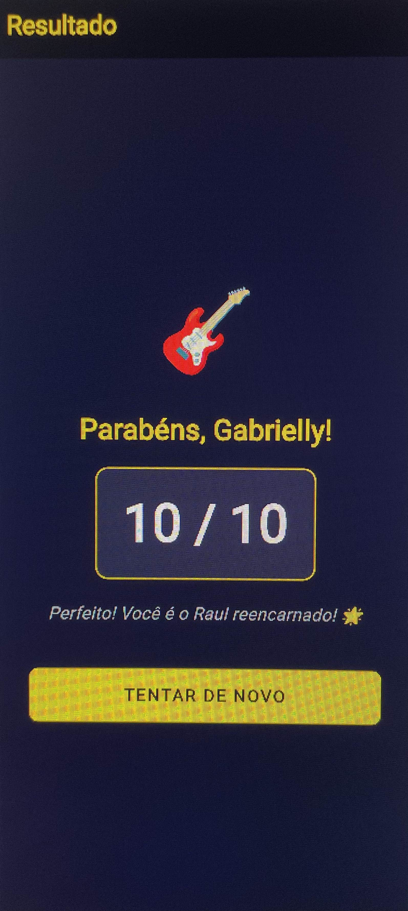
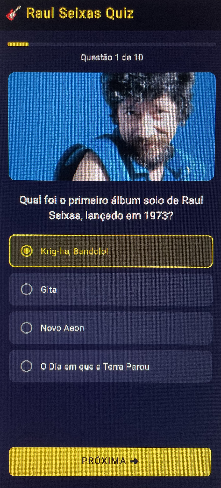
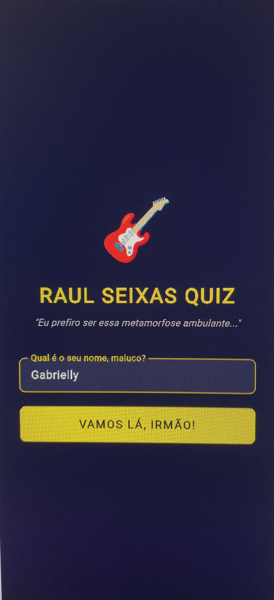

# 🎸 Quiz Raul Seixas

Um aplicativo de quiz interativo desenvolvido em Flutter com 10 perguntas sobre a vida e obra do lendário **Raul Seixas** — o Maluco Beleza do rock brasileiro.

---

## 📱 Telas do Aplicativo

### 🏠 Tela Inicial
- Campo para o jogador inserir seu **nome**
- Botão para iniciar o quiz

### ❓ Tela de Perguntas
- 10 perguntas de múltipla escolha sobre Raul Seixas
- Seleção de alternativas com feedback visual
- Navegação sequencial entre as perguntas

### 🏆 Tela de Resultado
- Exibe o nome do jogador e a **pontuação final** (acertos de 10)
- Botão **"Jogar Novamente"** para reiniciar o quiz

---

## 🚀 Como Executar

### Pré-requisitos

- [Flutter SDK](https://flutter.dev/docs/get-started/install) instalado
- Emulador Android/iOS configurado ou dispositivo físico conectado

### Passo a passo

```bash
    # Clone o repositório
    git clone https://github.com/seu-usuario/seu-repositorio.git

    # Acesse a pasta do projeto
    cd seu-repositorio

    # Instale as dependências
    flutter pub get

    # Execute o aplicativo
    flutter run
```

---

## 🛠️ Tecnologias Utilizadas

- [Flutter](https://flutter.dev/) — framework de desenvolvimento mobile multiplataforma
- [Dart](https://dart.dev/) — linguagem de programação

---

## 📁 Estrutura do Projeto
lib/
├── main.dart              # Ponto de entrada do app
├── screens/
│   ├── home_screen.dart   # Tela inicial com campo de nome
│   ├── quiz_screen.dart   # Tela de perguntas e alternativas
│   └── result_screen.dart # Tela de resultado final
└── data/
    └── questions.dart     # Banco de perguntas do quiz

> A estrutura pode variar conforme a organização do seu projeto.

---

## 📝 Sobre o Quiz

As perguntas abordam temas como:

- Discografia e músicas icônicas
- Vida pessoal e trajetória artística
- Parcerias e colaborações
- Curiosidades e fatos marcantes

---

## 📸 Screenshots

<p align="center">
  
  
  
</p>
